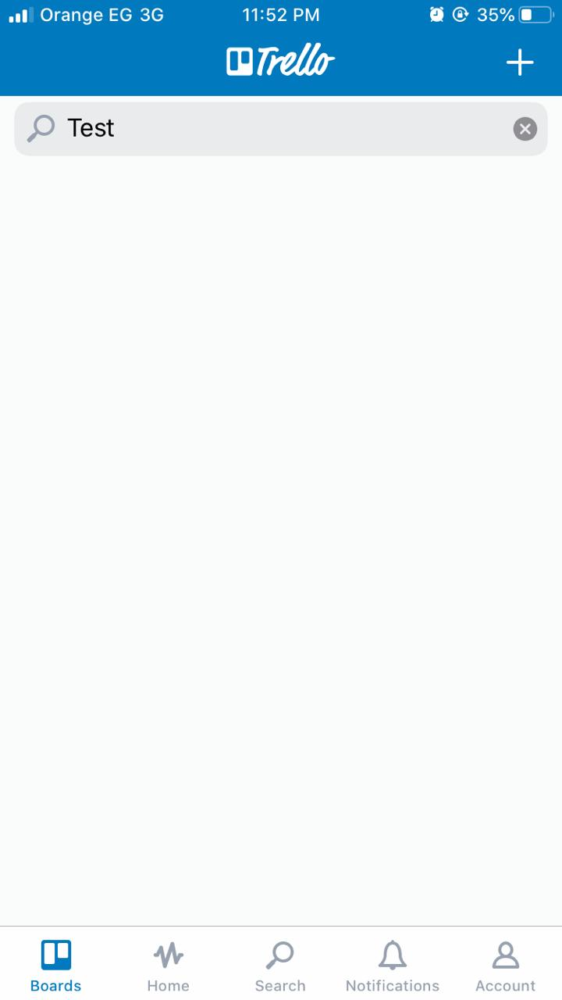

## TASK2
## Trello Issues:
## Bug ID: Bug_01

Title: The application is displaying an invalid message while the user is trying to reset his password without entering the email address and click on the send recovery link button.

Description: In case the user wants to reset his password and leaves the email address empty then clicks on the send recovery link button, the app will display an invalid error message related to there is no account for this email although the user did not enter an email.

Steps to reproduce:
  1. Launch the trello app.
  2. Click on sign in button >> app navigates to sign in screen.
  3. Click on forget your password button >> spp navigates to forget password screen.
  4. Leave the email address empty >> app accepts this action.
  5. Click on send recovery link >> app displays “There wasn’t an account for that email”
       
Actual result: The app displays this error message “There wasn’t an account for that email”

Expected result: The app should display this message “Please enter an email address”

Affected device: iPhone 8

Network : WiFi

Severity: Medium

Priority: Medium

Attachment: SC-1

## Bug ID: Bug_02

Title: The login in button color is not displaying  in green color as the rest of the buttons.

Description: The is no consistency between the color of all buttons as the login button is displaying in a gray color although the rest of the buttons are displaying in green color.

Steps to reproduce: 
   1. Lunch the trello app.
   2. Click on sign in button then check the sign in button color>> it is in green color.
   3. Back to the welcome screen then click on login button >> the app navigates to login screen.
   4. Check the login button color>> it is in gray color.
       
Actual result: The login button is displaying in gray color.

Expected result: The login in button should display in green color as the rest of buttons.

Affected device: iPhone 8

Network : WiFi

Severity: Medium

Priority: Low

Attachment: SC-2 , SC-2.1

## Bug ID: Bug_03

Title: The application is not displaying “No result found!” in case the user searches for a board that not exists.

Description: In case the user tries to search for non existing board, the system will not display “No result found!”.

Steps to reproduce: 
   1. log into trello. >> logged in successful.
   2. Click on boards tab >> boards screen is opened
   3. Click on search bar and write a non existing board name >> there is no “No result found!”
       
Actual result: The application is not displaying the “No result found!”

Expected result: The application should display “No result found!” in case there is no matched data found with the search input.

Affected device: iPhone 8

Network : WiFi

Severity: Medium 

Priority:  Medium

Attachment: SC-3

## Bug ID: Bug_04

Title: The application keeps the previous search results.

Description: In case the user searches for a card and moves to another tab and returns back, the user will find the previous result still display and the search input too.

Steps to reproduce: 
   1. log into the trello.>> logged successful.
   2. Click on search tab >> search tab is opened
   3. Search for a card. >> the result displays successful.
   4. Go to Home screen >> Home screen is opened
   5. Return back to search tab >> the result is still showing.
       
Actual result: The result of the previous search is displaying.

Expected result: The result of the previous search should be disappeared. Or we can keep the previous result in the recent search section and removing the search input.

Affected device: iPhone 8

Network : WiFi

Severity: Low

Priority: Low

Attachment: SC-4

## Bug ID: Bug_05

Title: The application displays an invalid message in case the user user tries to sign up without entering a password.

Description: The application displays an error message that is not meaningful regarding the error scenario, it is displaying “Please enter a password ” instead of “Password must be at least 8 characters long”.This issue is existing in (full name and email address also)

Steps to reproduce: 
   1. launch the trello app.
   2. Click on sign up button>> the sign up screen is opened.
   3. Fill out the Name and Email by valid data >> Name and email are filled out.
   4. Leave the password field empty >> app accepts this action.
   5. Click on the Sign up button >> app displays an error message.“Password must be at least 8 characters long”.
       
Actual result: The application displays “Password must be at least 8 characters long”.

Expected result: The application should display “Please enter a password ” instead of “Password must be at least 8 characters long”.

Affected device: iPhone 8

Network : WiFi

Severity: Low

Priority: Low

Attachment: SC-5

## Bug ID: Bug_06

Title: The board name is not unique. 

Description: The board name is not unique, the user can add more than one board or card that has the same name.

Steps to reproduce: 
   1. log into trello.>> logged in successful.
   2. Click on + icon and add a board has name test >> The test board is added.
   3. Click again and try to add another board has name test >> the second board test is added.
       
Actual result: The user can add one ore more board that has the same name.

Expected result: The board name should be a unique name and when the user try to add a board has the same name the app should display an error message.

Affected device: iPhone 8

Network : WiFi

Severity: Medium

Priority: High

Attachment: SC-6

## Bug ID: Bug_07

Title: The Notifications screen does not display “There is no notification yet!”, in case the user has no notifications yet.

Description: The Notifications screen does not display “There is no notification yet!” or another hint message in case the user has no notifications yet.

Steps to reproduce: 
   1. Sign up into trello app >> created an account successful.
   2. Log into trello app.>> logged in successful.
   3. Click on notification tab >> there is no  “There is no notification yet!” message.
       
Actual result: The notification screen empty.

Expected result: The app should display “There is no notification yet!”

Affected device: iPhone 8

Network : WiFi

Severity: Medium

Priority: Low

Attachment: SC-7

## Bug ID: Bug_08

Title: The application displays “Marked all as read” message when the user tries to mark them although there is no notifications.

Description: he application displays “Marked all as read” message when the user tries to mark them although there is no notifications, the application should display a hint message to the user inform him that there is no notifications to mark them.

Steps to reproduce: 
   1. Sign up into trello app >> created an account successful.
   2. Log into trello app.>> logged in successful.
   3. Click on notification tab and click on the mark icon >> the app displayed “Marked all as read” 
       
Actual result: The application displays “Marked all as read”

Expected result: The application should notify the user by that “there are no notification to mark them”

Affected device: iPhone 8

Network : WiFi

Severity: Low

Priority: Low

Attachment: SC-8

